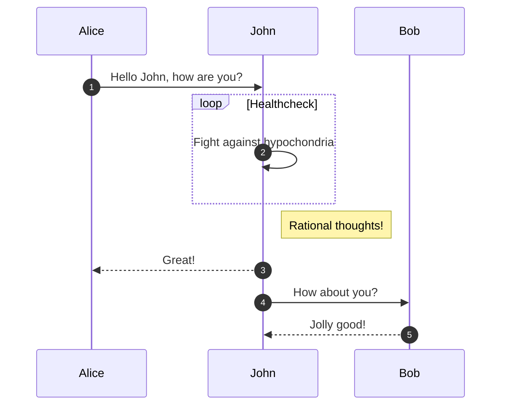
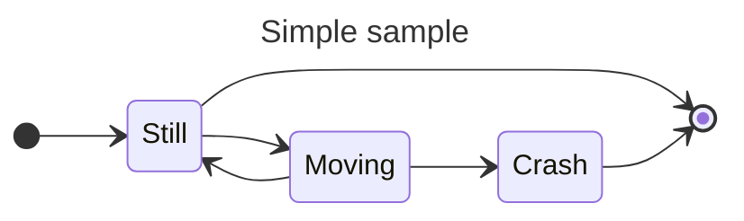
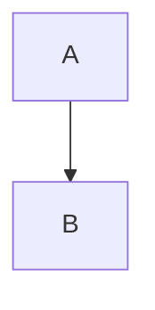

# Random stuff to be fixed

La `subshell` como equivalente a la oración subordinada, apuntará a un
isomorfismo en tonalidad poética?

| Enunciado                 | Posible equivalente semántico |
| :------------------------ | :---------------------------- |
| Creo que reconozco eso    | `assert_c $(assert_r obj)`    |
| Creo en eso               | `assert_c < obj`              |
| Reconozco eso             | `assert_r obj`                |
| Creo reconocer eso        | `assert_r --mod assert_c obj` |


$$\begin{aligned}
    f(x) &= x^2\\\
    g(x) &= \frac{1}{x}\\\
    F(x) &= \int^a_b \frac{1}{3}x^3
\end{aligned}$$

```
Yo recuerdo que
    tu me dijiste que
        tu le habias dicho a tu amigo que
            tu creias que
                yo ganaria un premio.

Mi memoras,
    ke vi diris al mi
        ke via amiko diris al vi,
            ke li kredas,
                ke mi gajnos premion,
                    kiam la bovino flugis.
```


    Del río el canto,
        la sombra del árbol,
    y tú mi nardo.
---
    Acero afila
        la espiga erguida. Masa,
    el fuego aviva.
---
    Rema al Faro,
        ella Silba con el Sol:
    ¿Dónde Fantásia?
---
    Cisne descansa.
        Perfuma la orquídea añíl
    tu sueño en calma.
---
    Baldosa en piso azafrán
        que arena sueña,
    ¿Bagdad su libro hojea?
---
    Teclado tristón, polvoso te ves.
        ¿Perdiste el space? Tu culpa no es.
    Cactus golpeó, marca Dino seis mil.
        Destino, mártir por corte wifi.
---
    Era el triangulo una figura de tres lados.
        Y el cuadrado una figura cerrada de lados iguales y ángulos rectos.
    Y el cuadrado triangular era en el plano elíptico.
---
    For them, it was the beginning of their world:
        their creation mythos, their Genesis.
    But for Long Morrison and Smudge, it was Tuesday.
---
    Él olvidó que el
        olmo verde vuelve a ser.
    Junto al río se fue.
---
    Su arco tensó.
        Lluvia ignea en el trigal
    consumió a la flor.
---
    In the three-sided figure was the triangle.
        And the square was a closed figure equal sided with right angles.
    And the triangular square in the elliptical plane.

_For Haskell so loved the `world -> (a, world)` that it gave us the
`IO Monad`, that whosoever composes with it should not be impure,
but free of side effects._

{ align=right }

## Diagram







<iframe style="border-radius:12px" src="https://open.spotify.com/embed/track/7sN1tm3gbqMbDTG5doUb2p?utm_source=generator&theme=0" width="100%" height="152" frameBorder="0" allowfullscreen="" allow="autoplay; clipboard-write; encrypted-media; fullscreen; picture-in-picture" loading="lazy"></iframe>

$$\text{The conclusion:}\: \Diamond aPx \rightarrow \Box bQy$$
